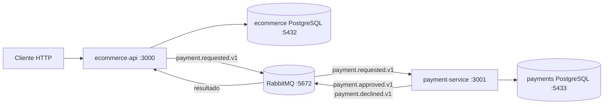

# Mini E-commerce distribuído em Go

API de clientes, catálogo, estoque e pedidos integrada a um serviço de pagamentos independente. O projeto usa Go, `net/http`, PostgreSQL, `sqlc`, RabbitMQ, JWT, Docker Compose e uma Saga orquestrada com Outbox/Inbox.

O checkout reserva estoque e cria um pedido `PENDING`. O pagamento acontece de forma assíncrona: a API inicia a Saga, o `payment-service` autoriza ou recusa a cobrança simulada e a API confirma o pedido ou compensa a reserva.

## Arquitetura



| Componente | Responsabilidade exclusiva |
| --- | --- |
| `ecommerce-api` | Clientes, autenticação, produtos, estoque, pedidos, estado da Saga e compensação. |
| `payment-service` | Autorizar pagamentos simulados e persistir pagamentos. |
| PostgreSQL `ecommerce` | Dados da API, `order_sagas`, Outbox e Inbox da API. |
| PostgreSQL `payments` | `payments`, Outbox e Inbox do serviço de pagamentos. |
| RabbitMQ | Transportar comandos e eventos duráveis entre os processos. |

Cada serviço possui seu próprio schema e binário. O pagamento foi extraído porque tem ciclo de vida, disponibilidade e persistência próprios; a API não consulta tabelas do serviço de pagamento. Dentro de cada módulo, domínio e casos de uso não dependem de HTTP, SQL ou RabbitMQ: adaptadores externos implementam os contratos definidos pela aplicação.

## Fluxo da Saga

| Etapa | Pedido | Saga | Mensagem/ação | Falha e compensação |
| --- | --- | --- | --- | --- |
| Criar pedido | `PENDING` | — | Reserva estoque na transação local. | Rollback local se cliente, produto ou estoque for inválido. |
| Solicitar pagamento | `PAYMENT_PENDING` | `PROCESSING` | API salva `payment.requested.v1` na Outbox. | Repetir `/pagar` retorna `409`; a Outbox tenta novamente. |
| Aprovar | `PAYMENT_PENDING` | `PROCESSING` | Pagamento salva cobrança `APPROVED` e `payment.approved.v1`. | Entrega é repetida até confirmação. |
| Concluir | `PAID` | `COMPLETED` | API consome o resultado aprovado. | Inbox ignora mensagens já processadas. |
| Recusar | `PAYMENT_PENDING` | `PROCESSING` | Pagamento salva cobrança `DECLINED` e `payment.declined.v1`. | API devolve os itens ao estoque. |
| Compensar | `CANCELED` | `COMPENSATED` | Atualiza pedido, estoque e Saga na mesma transação local. | Uma falha transitória provoca nova entrega. |

O gateway é deliberadamente determinístico: valores cujo total em centavos termina em `13` (`amount_cents % 100 == 13`) são recusados; os demais são aprovados. Isso permite demonstrar ambos os caminhos sem um provedor externo.

### Contratos de mensagens

Toda mensagem usa um envelope versionado:

```json
{
  "message_id": "uuid",
  "message_type": "payment.requested.v1",
  "saga_id": "uuid",
  "correlation_id": "uuid",
  "occurred_at": "2026-08-30T12:00:00Z",
  "payload": {
    "order_id": "uuid",
    "amount_cents": 1013
  }
}
```

| Exchange | Routing key | Tipo |
| --- | --- | --- |
| `ecommerce.commands` | `payment.requested` | `payment.requested.v1` |
| `ecommerce.events` | `payment.approved` | `payment.approved.v1` |
| `ecommerce.events` | `payment.declined` | `payment.declined.v1` |

As publicações são persistentes e aguardam confirmação do broker. Cada alteração de negócio e sua mensagem de saída são salvas na mesma transação por Outbox. Cada consumidor registra `message_id` em sua Inbox antes de aplicar efeitos, tornando o processamento idempotente sob entrega *at least once*. Falhas transitórias usam atraso exponencial limitado a um minuto; contratos inválidos ou mensagens acima de `MESSAGE_RETRY_LIMIT` seguem para a fila `.dead` correspondente.

## Requisitos e início rápido

- Go 1.26.2 ou compatível;
- Docker com Docker Compose;
- Make, `curl` e um shell POSIX para a demonstração.

Suba todo o ambiente:

```bash
cp .env.example .env
make compose-up
docker compose ps
make demo
```

Serviços disponíveis:

- API e health: `http://localhost:3000/health`;
- health do pagamento: `http://localhost:3001/health`;
- RabbitMQ Management: `http://localhost:15672` (`guest`/`guest` apenas no ambiente local);
- PostgreSQL da API: `localhost:5432`;
- PostgreSQL de pagamentos: `localhost:5433`.

Para encerrar sem remover os volumes:

```bash
make compose-down
```

As duas aplicações aplicam automaticamente apenas as migrations do próprio banco durante a inicialização.

## Configuração

| Variável | Padrão/função |
| --- | --- |
| `APPLICATION_PORT` | Porta da API, padrão `3000`. |
| `APPLICATION_ENVIRONMENT` | Nome do ambiente da API. |
| `POSTGRESQL_DATA_SOURCE` | DSN exclusivo do banco `ecommerce`. |
| `PAYMENT_APPLICATION_PORT` | Porta de health do pagamento, padrão `3001`. |
| `PAYMENT_POSTGRESQL_DATA_SOURCE` | DSN obrigatório e exclusivo do banco `payments`. |
| `JSON_WEB_TOKEN_SECRET` | Segredo de assinatura; deve ser trocado fora do ambiente local. |
| `JSON_WEB_TOKEN_ISSUER` | Emissor do JWT. |
| `JSON_WEB_TOKEN_LIFETIME` | Duração do token, por exemplo `15m`. |
| `RABBITMQ_URL` | URL AMQP usada pelos dois serviços. |
| `RABBITMQ_COMMAND_EXCHANGE` | Exchange de comandos, padrão `ecommerce.commands`. |
| `RABBITMQ_EVENT_EXCHANGE` | Exchange de eventos, padrão `ecommerce.events`. |
| `RABBITMQ_PAYMENT_QUEUE` | Fila de solicitações, padrão `payment.requests`. |
| `RABBITMQ_RESULT_QUEUE` | Fila de resultados, padrão `ecommerce.payment-results`. |
| `OUTBOX_INTERVAL` | Intervalo de polling, padrão `250ms`. |
| `OUTBOX_BATCH_SIZE` | Máximo de mensagens por lote, padrão `20`. |
| `MESSAGE_RETRY_LIMIT` | Máximo de novas tentativas, padrão `5`. |
| `SHUTDOWN_TIMEOUT` | Prazo de encerramento HTTP, padrão `5s`. |
| `BASE_URL` | Sobrescreve a URL da API no script de demonstração. |
| `PAYMENT_BASE_URL` | Sobrescreve a URL do health de pagamentos no script. |
| `COVERAGE_MINIMUM` | Cobertura mínima, padrão `40.0`. |

`PAYMENT_POSTGRESQL_DATA_SOURCE` e `RABBITMQ_URL` são obrigatórias no processo de pagamento. O arquivo `.env.example` contém valores somente para desenvolvimento local.

## Desenvolvimento

```bash
make run-api          # API, usando .env
make run-payment      # serviço de pagamento, usando .env
make build            # gera bin/ecommerce-api e bin/payment-service
make test
make vet
make coverage         # falha abaixo de 40%
make check            # sqlc, formatação, testes, vet e build
```

Para executar apenas a infraestrutura e iniciar os processos pelo Go:

```bash
make database-up
make payment-database-up
make run-api
# em outro terminal
make run-payment
```

Queries ficam em `internal/platform/database/queries` e `internal/payment/platform/database/queries`. A geração é fixada no `sqlc` 1.31.1:

```bash
make sqlc
make sqlc-check
```

O migrador manual `make migrate-up`/`make migrate-down` atua no banco da API; o schema de pagamentos é migrado pelo próprio `payment-service`.

## Demonstração e observabilidade

`make demo` cria dois produtos e dois pedidos. Um total de `1000` chega a `PAID`; outro de `1013` chega a `CANCELED`. O script consulta o PostgreSQL da API para confirmar que o estoque recusado foi restaurado, além de validar conflitos `409`, recurso ausente `404`, JSON inválido `400` e paginação.

Os processos escrevem um objeto JSON por linha com `service`, `operation`, `result` e identificadores seguros. Para seguir uma Saga nos dois serviços:

```bash
CORRELATION_ID="valor-retornado-por-/pagar"
docker compose logs ecommerce-api payment-service | grep "$CORRELATION_ID"
```

Corpos de mensagens, senhas, hashes, tokens e DSNs não são registrados.

## Rotas

As rotas do desafio são públicas e usam os nomes pedidos pelo enunciado:

| Método | Rota | Resultado principal |
| --- | --- | --- |
| `POST` | `/clientes` | Cria cliente (`password` ou o alias `passwordHash`). |
| `GET` | `/clientes` | Lista clientes sem hashes. |
| `GET` | `/clientes/{customerID}` | Consulta cliente. |
| `POST` | `/produtos` | Cria produto. |
| `GET` | `/produtos` | Lista produtos. |
| `GET` | `/produtos/{productID}` | Consulta produto. |
| `POST` | `/pedidos` | Reserva estoque e cria pedido `PENDING`. |
| `GET` | `/pedidos?limit=20&offset=0` | Lista pedidos. |
| `GET` | `/pedidos/{orderID}` | Consulta o pedido e seu status atual. |
| `POST` | `/pedidos/{orderID}/pagar` | Inicia a Saga e retorna `202`. |
| `POST` | `/pedidos/{orderID}/cancelar` | Cancela pedido elegível e libera estoque. |

O campo de entrada `passwordHash` existe somente por compatibilidade com o desafio: seu valor ainda é tratado como senha e transformado em bcrypt no servidor. Nenhum hash é retornado pela API.

As rotas originais `/api/authentication`, `/api/products`, `/api/inventory` e `/api/orders` continuam disponíveis. Operações protegidas recebem:

```http
Authorization: Bearer ACCESS_TOKEN
```

## Estrutura

```text
cmd/api/                                      composição e HTTP da API
cmd/payment/                                  processo independente de pagamentos
internal/*/domain/                            entidades e transições
internal/*/usecase/                           casos de uso e portas
internal/*/adapter/http/                      transporte HTTP
internal/*/adapter/messaging/                 consumidores de eventos
internal/*/adapter/repository/sqlc/           persistência da API
internal/payment/platform/database/           schema e sqlc exclusivos de pagamentos
internal/platform/events/                     envelopes e contratos versionados
internal/platform/messaging/                  RabbitMQ, retry e dead letter
internal/platform/outbox/ e inbox/            garantias de entrega e idempotência
scripts/http-flow.sh                           demonstração ponta a ponta
```
